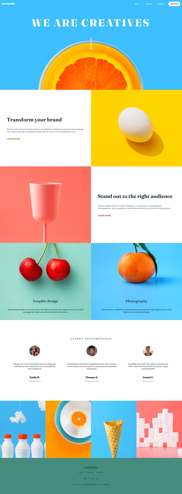

# Frontend Mentor - Sunnyside agency landing page solution

This is a solution to the [Sunnyside agency landing page challenge on Frontend Mentor](https://www.frontendmentor.io/challenges/sunnyside-agency-landing-page-7yVs3B6ef). Frontend Mentor challenges help you improve your coding skills by building realistic projects.

## Table of contents

- [Overview](#overview)
  - [The challenge](#the-challenge)
  - [Screenshot](#screenshot)
  - [Links](#links)
- [My process](#my-process)
  - [Built with](#built-with)
- [Author](#author)

**Note: Delete this note and update the table of contents based on what sections you keep.**

## Overview

### The challenge

Users should be able to:

- View the optimal layout for the site depending on their device's screen size
- See hover states for all interactive elements on the page

### Screenshot

### Links

- Live Site URL: 

## My process

### Built with

- Semantic HTML5 markup
- CSS custom properties
- Flexbox
- Grid
- [React](https://reactjs.org/) - JS library
- [Sass/Scss](https://sass-lang.com/) - For styles
- [Styled Components](https://styled-components.com/) - For styles

## Author

- Frontend Mentor - [@marcoberdiano](https://www.frontendmentor.io/profile/marcoberdiano)
- Twitter - [@Maraujopaulo](https://www.twitter.com/Maraujopaulo)tion's content as necessary. If you completed this challenge by yourself, feel free to delete this section entirely.**
